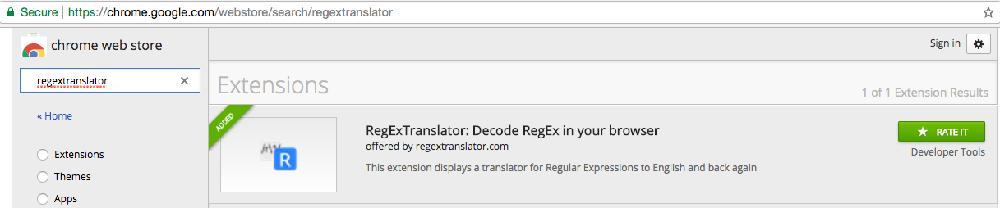

# RegExTranslator.com

## Background

This web application began with a question: Is it possible to build a Google Translate for regular expressions? It turns out that with 9 days and an amazing team of engineers in San Francisco, the answer is a resounding, "Yes."

Regular expression are incredibly useful and powerful. Their abstract nature allows them to be used in almost all modern programming languages. This very level of abstractness however is also what makes regular expressions difficult for even experienced programmers to parse. The intent of **RegEx Translator** is to turn regular expressions into something more readable. In addition to decoding regex, our web app’s two-way translation service makes Regular Expressions more accessible for programmers to craft and modify. You can even save regular expressions to your account, and keep a toolkit of your own analytical creations to return to and modify as needed.

## Core Functionality

Wouldn't it be cool if you could translate a regular expression into English, tinker with it, and then translate it back into code?

Well, now you can. Creating a regular expression in either English or classical syntax will also highlight matched patterns in an example body of text. It can even display the results of common operations performed on matched patterns, such as replacing text.

## The Translator


The app's main page is roughly modeled on [Google Translate](https://translate.google.com/)  

## Technologies

RegexTranslator.com is a web application built on the Meteor platform, an implementation of Node.js.

The database is MongoDB, specifically using mLab for deployment, and the frontend is developed in React with a Redux cycle.

Technologies used:

- Node.js with Meteor.js
- MongoDB (developer side) & mLab MongoDB (deployment)
- React.js
- Redux.js
- SRL, an open-source library
- Regex Tokenizer
- OAuth
- BCrypt
- Papertrail
- Cloudflare
- Segment.io and Google Analytics

## Members and Responsibilities

- David Corson-Knowles, Server, Coordination, Libraries, SSL, OAuth, UX, Analytics, Chrome Extension
- Adam Jacobson, RegEx to SRL, a new technology
- Rod Shokrian, OAuth, Personalization, RegEx Pattern Library, Redux, mLab and Mongo Database
- Andy Booth, SASS, Redux, Integration, SRL to RegEx, Swapping, UI


## Timeline

## Peek inside the Code

```JavaScript
    const publicPatterns = Object.keys(this.props.regexs).map((id) => {
      if (!(this.props.regexs[id].hasOwnProperty("userId"))) return (
        <button className="dropdown-item" key={id}
          onClick={() => this.props.regexSelector(this.props.regexs[id].pattern)}>
            {this.props.regexs[id].name}
        </button>
        );
      }
    );

    const privatePatterns = Object.keys(this.props.regexs).map((id) => {
      if (this.props.regexs[id].hasOwnProperty("userId")) return (
        <button className="dropdown-item" key={id}
          onClick={() => this.props.regexSelector(this.props.regexs[id].pattern)}>
            {this.props.regexs[id].name}
        </button>
        );
      }
    );
```


Input handling

```JavaScript
    srlInputHandler(event) {
      // Set SRL slice
      this.props.receiveSrl(event.target.value);

      const srl = engToSrl(event.target.value.replace(/\n/g, ' '));
      try {
        // NOTE: Error causing line
        const regex = new Srl(srl);

        // Get regex data for state
        const regexText = regex.getRawRegex();
        const flags = regex._modifiers.split('');

        // Set regex to SRL-translated version and clear errors
        this.props.setRegex(regexText);
        this.props.setRegexFlags(flags);
        this.props.clearSrlErrors();
      } catch(error) {
        // If SRL parsing fails, set errors
        this.props.receiveSrlErrors(['Invalid SRL syntax', error]);
      }
    }
 ```

 Box swap!

 ```JavaScript
       <div className="translator">
          {
            this.state.inputBoxOrder.map((Component, idx) => (
              <Component
                key={idx}
                idx={idx}
                swap={this.swapInputBoxes}
                swapped={this.state.swapped}
              />
            ))
          }
      </div>
 ```

Transfer functions
```JavaScript
            <div className="transfer-functions">
              
              <div onClick={this.handleFunctionButtonClick}>
                <button className="transfer-function-active">Match</button>
                <button>Capture</button>
                <button>Split</button>
                <button>Replace</button>
                <input
                  onChange={this.handleReplaceInputChange}
                  value={this.state.replaceText} />
              </div>
            </div>

```


## New Directions

- [ ] Because this web application is built in the Meteor framework on Node, it will be straightforward to deploy native iOS and Android apps delivering the same features. Because this is a developer tool, any mobile users would be more likely to be on tablets than phones.

- [ ] Further extension of the translation dictionary. Creating a user extensible dictionary will allow the language to grow and evolve freely to meet the needs of developers using the tool.

- [ ] Autocomplete, Dev API, User suggested translations.  

### Bonus Feature

- [x] Google Chrome Extensions


