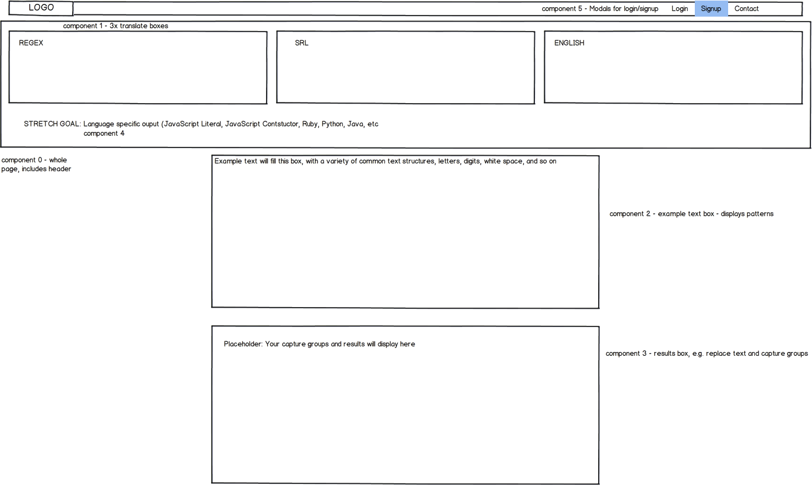
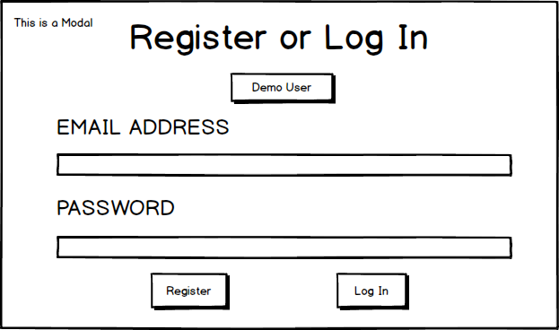

# RegExTranslator.com

## Background

Regular expression are incredibly useful and powerful. Their abstract nature allows them to be used in almost all modern programming languages. This very level of abstractness however is also what makes regular expressions difficult for even experienced programmers to parse. The intent of **RegEx Translator** is to turn regular expressions into something more readable. In addition to decoding regex, we intend for our web app’s extended features to make Regular Expressions more accessible for programmers to craft and modify.

## Core Functionality

Users will be able to translate and transpile between common programming languages (e.g., Javascript), Simple Regex Language (SRL), and something approximating natural language. Creating a regex with any of these languages will also highlight matched patterns in an example body of text and display the results of common operations performed on matched patterns, such as replacing text.

A non-exhaustive list of features:

- [ ] RegEx to SRL
- [ ] English to SRL
- [ ] SRL to English
- [ ] web implementation for SRL to RegEx (an existing technology)
- [ ] pattern translation
- [ ] Component for RegEx matching text
- [ ] Large text database to generate example matches for a given regular expression
- [ ] Common words to ignore (English words and insertion syntax for common languages, e.g. the initial and trailing slashes )
- [ ] Algorithmic RegEx parser
- [ ] Common RegEx patterns, like phone numbers, addresses and so on
- [ ] RegEx multi-language support
- [ ] User accounts and user customizations
- [ ] Logic for aggregating user contributions and common customizations


## Wireframes


The app's main page is roughly modeled on [Google Translate] (https://translate.google.com/) and [Babel](https://babeljs.io/). The core translation and transpilation functionality of the app will be handled through the 3 'translate boxes.' Further features, like example text pattern match highlighting (component 2) and a capture groups/results box (component 3) will be displayed further down the page.



## Technologies

RegexTranslator.com is a web application built on the Meteorjs platform, an implementation of Nodejs.

The database is MongoDB, specifically using mLab for deployment, and the frontend will be developed in React with a Redux cycle.

Technologies used:

- Node.js with Meteor.js
- MongoDB & mLab MongoDB
- React
- Redux
- SRL

### External APIS
We plan to use the 'Big Huge Thesaurus' API to retrieve synonyms for SRL parameters. SRL supports the use of natural language-like commands, but we will extend this functionality and allow the creation of more flexible SRL inputs by matching synonyms.

[Big Huge Thesaurus](https://words.bighugelabs.com/api.php)

## First weekend

- [ ] Wireframe showing the 5 key components of the app
- [ ] Meteor backend up and running
- [ ] mLab version of MongoDB provisioned
- [ ] Repo running on 3/4 team member's machines
- [ ] Master branch protected, with feature-branch workflow in place
- [ ] Heroku hosting with custom domain configured
- [ ] Heroku live updating from the master branch on GitHub

## Members and Responsibilities

- David Corson-Knowles
- Adam Jacobson
- Rod Shokrian
- Andy Booth

## Timeline

### Day 1 - Saturday August 5th
-Adam: Import and setup SRL built in functionality

-Andrew: Set up real-time SRL to RegEx translation

-Dave: Requisition logo and setup Heroku live deployment through GitHub master branch, link Heroku to live URL with DNS settings, create wireframe for the single source of content

-Rod: Set up DB and basic validations, publications

### Day 2 - Sunday August 6th
-Adam: Basic framework for Regex to SRL translations. Not all functions supported.

-Andrew: Hook SRL translation into Redux cycle and begin styling
[configure papertrail](https://elements.heroku.com/addons/papertrail)

-Dave: Create Favicon, provision database, begin modal for UI of auth

-Rod: Work on README, provide moral support for team.

### Day 3 - Monday August 7th
-Adam: Continue to build out Regex to SRL translations. Include more obscure regex patterns

-Andrew: Get the git cycle working. Get reverse translation barely going in ui.

-Dave: Finish modal for user authentication on the front end

-Rod: Get a workstation, actually work on project. Build out user auth, help David with modals (?)

### Day 4 - Tuesday August 8th
-Adam: Begin work on English to SRL translations. Test functionality of front-end components.

-Andrew: Continue to develop reverse translation. Optimize live search results for SRL to Regex

-Dave: Translate REGEX

-Rod: Absolutely crush it.

### Day 5 - Wednesday August 9th
-Adam: Continue building out English to SRL functionality. Import and verify synonyms from external API.

-Andrew: Create a framework for group analysis, starting with high-level groups and working down

-Dave: TRANSLATE MORE REGEX

-Rod: Continue crushing it.

### Day 6 - Thursday August 10th
-Adam: Populate database with pre-built regex and SRL patterns

-Andrew: Build abstract syntax tree to model nesting of groups, sets, etc.

-Dave: POLISH, POLISH

-Rod: Take a brief break from crushing it

### Day 7 - Friday August 11th
-Adam: Set up and validate subscriptions. Continue to populate DB with pre-built regex patterns

-Andrew: Style and polish front-end components

-Dave: Activities unknown. Whereabouts certain

-Rod: Ramp up to 2nd round of crushing it

### Day 8 - Saturday August 12th
-Adam: Built out replace and capture group functionality

-Andrew: Implement language-specific output along with function generation

-Dave: Triple-check this for categorical inclusion: https://developer.mozilla.org/en-US/docs/Web/JavaScript/Guide/Regular_Expressions

-Rod: Get checked for Chronic Crushing it Syndrome (CCS), get cleared by medical team, continue to crush it

### Day 9 - Sunday August 13th
-Adam: Polish and test components.

-Andrew: Fix bugs and style components further

-Dave: SUBMIT SUBMIT

-Rod: Crush it with a bang. Stretch goal: smash it


*** Data Structure
The bulk of the translation burden can be handled with a translation hash, a list of key-value pairs that matches RegEx expressions to English language translations. Since translation from RegEx must be 1-to-1, it will have a simpler hash. Translation from English into RegEx can take multiple potential phrasings, so the translation hash will be much more extensive. Fortunately the structure of the hash still provides clear translation for simple expressions.

*** Control Flow
In addition, we will need to build several variables to track state as we iterate through the string to translate an expression. For instance, the meaning of characters changes while inside square brackets. With a state variable, we can set the insideSquareBrackets boolean to true when we pass a valid bracket and set it to false once more when we pass the closing bracket. We can handle deeper nesting by iterating a count variable and then decrementing it as each corresponding closing bracket is reached.
Meanwhile, we can also check that characters are being escaped (with a backslash '\') in a similar fashion. This would also prevent escaped square brackets from being misinterpreted.

[regextranslator.com](http://regextranslator.com)
```
sampleTranslations = {
  phone_numbers: " ^(?:(?:\+?1\s*(?:[.-]\s*)?)?(?:\(\s*([2-9]1[02-9]|[2-9][02-8]1|[2-9][02-8][02-9])\s*\)|([2-9]1[02-9]|[2-9][02-8]1|[2-9][02-8][02-9]))\s*(?:[.-]\s*)?)?([2-9]1[02-9]|[2-9][02-9]1|[2-9][02-9]{2})\s*(?:[.-]\s*)?([0-9]{4})(?:\s*(?:#|x\.?|ext\.?|extension)\s*(\d+))?$ ",
  email_address: " ^([a-zA-Z0-9_\-\.]+)@([a-zA-Z0-9_\-\.]+)\.([a-zA-Z]{2,5})$ "
  A_or_B: " (A|B) "
  urls: “^(((ht|f)tp(s?))\://)?((([a-zA-Z0-9_\-]{2,}\.)+[a-zA-Z]{2,})|((?:(?:25[0-5]|2[0-4]\d|[01]\d\d|\d?\d)(?(\.?\d)\.)){4}))(:[a-zA-Z0-9]+)?(/[a-zA-Z0-9\-\._\?\,\'/\\\+&amp;%\$#\=~]*)?$”


}
```
[Favorite Regex](http://www.catonmat.net/blog/my-favorite-regex/)
